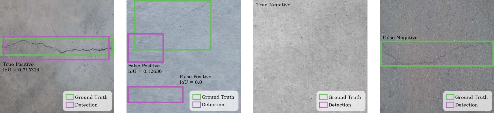

# retoCATEC22
Solution to the second computer vision [CATEC challenge](https://sites.google.com/view/retopercepcioncatec/inicio) proposed for Jan 2022.

The objective of the challenge is to train a model to be able to detect defects (more precisely: cracks) similar to those in the provided dataset. The dataset is derived from the [Crack Segmentation Dataset (Kaggle)](https://www.kaggle.com/lakshaymiddha/crack-segmentation-dataset) and It was provided by CATEC and uploaded to [Google drive](https://drive.google.com/uc?id=1QaZmWaAlnik7P7V4ju1saVVuEqhHXcr4).



## Installation
Create a virtual environment with Python 3.8.
```shell
python3.8 -m venv env
source env/bin/activate
```
Install the [PyTorch Stable 1.10.1](https://pytorch.org/get-started/locally/) according to your compute platform following the official guide.

```shell
# Installation including CUDA 10.2
pip install install torch torchvision torchaudio
```

To run the notebooks locally install Jupyter Notebooks (optional):

```shell
pip install ipykernel notebook
python -m ipykernel install --user --name=env
```

Install all dependencies:

```shell
pip install -r requirements.txt
```

## Inference

A modified version of the `yolov5v6/detect.py` module is included so inference results are outputted in the format required by the challenge.

```shell
python yolov5v6/catecdetect.py --source 'test/images' --weights catecnetyv5nano.pt --nosave --save-txt --project inference --name detectcatec
```

## Training

Training was done in an instance of [Gradient notebooks](https://gradient.run/).

For more information on the training run, there is a [report](https://wandb.ai/carloscabello/YOLOv5/reports/YOLOv5-training-on-the-CATEC-dataset--VmlldzoxNDc1NDg3?accessToken=zjn68md1ugqsp8wirbmykc9arwr9l5in1cdo5cwjqkryvt573j0at39oik3mz5n5) made with [wandb](https://wandb.ai).
